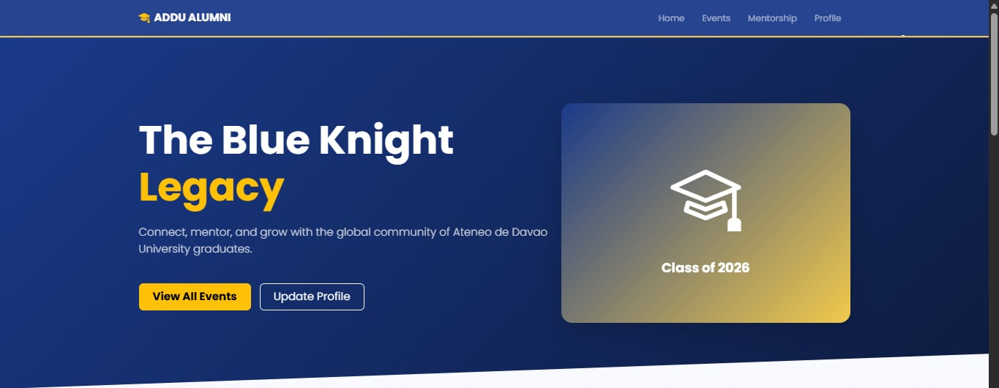
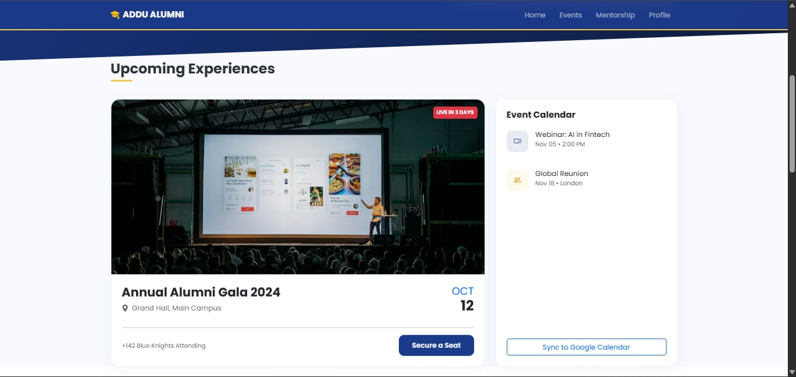
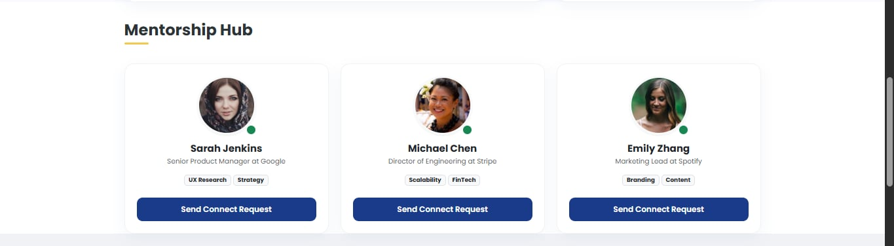
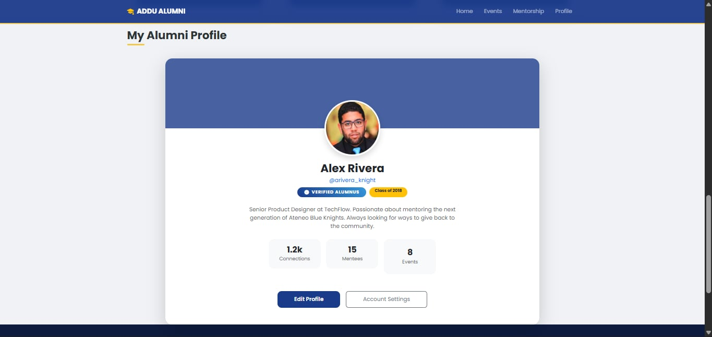
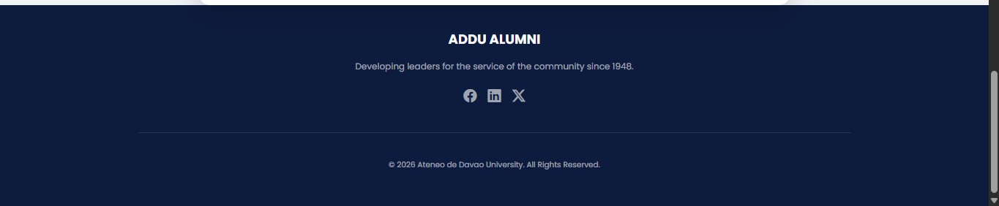

## AdDU Alumni Legacy

Framework: AngularJS (v1.8)
Module: Module 2 - Networking
AI Tools Used: Gemini AI, Claude AI

---

## Project Overview
The AdDU Alumni Legacy is a modern, responsive web-based alumni portal prototype designed specifically for Ateneo de Davao University (AdDU). It serves as a digital hub where graduates can reconnect, explore mentorship opportunities, manage their professional profiles, and stay updated on university events — all through an intuitive, visually rich interface inspired by AdDU’s branding.

This project was developed to transition a mobile-first design into a web-native environment. The goal was to explore how AngularJS handles a single-page scrolling architecture and to understand the developer flow when converting 18 distinct mobile screens into a cohesive desktop experience using AI-assisted coding.

---

## How Does It Work?
The application is built using AngularJS (v1.8) with Bootstrap 5 for layout and custom CSS for high-fidelity styling. Key features include:
Single-Page Scrolling Navigation: A modern web approach where the navigation bar anchors users to specific sections (Home, Events, Mentorship, Profile) without page reloads.
Mentorship Hub: Utilizes AngularJS ng-repeat directives to dynamically display mentor cards and connection matches.
Premium UI Design: Features "Glassmorphism" effects on the navbar, smooth scroll behaviors, and interactive hover states for a professional "2026" aesthetic.
Responsive Grid: Reimagines 18 mobile screens into a desktop-friendly multi-column layout using the Bootstrap grid system.
Static Asset Integration: All icons and imagery are served via CDNs or local paths, ensuring the visual fidelity of the original design is maintained in the web version.

---

## Prerequisites
Before running this project, ensure you have the following installed on your computer:
- **Visual Studio Code** (VS Code): [Download here](https://code.visualstudio.com/)
- **Live Server Extension**: Install this within VS Code (by Ritwick Dey) to handle the local hosting required for AngularJS.
- **A Web Browser**: Chrome, Edge, or Firefox.
(Note: Because this uses AngularJS via CDN, making it lightweight and fast to preview.)

---

## Installation
Follow these steps to run the project on your computer:
1. Clone the repository:
   ```bash
   git clone https://github.com/kyljhndeb/firstattempt2026_dagunsa.git

2. Navigate to the project directory:
   ```bash
   cd firstattempt2026_dagunsa
   
3. Open in VS Code: Type
   ```bash
   code .
  in your terminal or open the folder manually in VS Code.
  
4. Run the application: Open
   ```bash
   index.html,
  then click the "Go Live" button in the bottom-right corner of the VS Code status bar.

5. Open your browser: Visit
   ```bash
   http://127.0.0.1:5500
  to view the application.

---

## Prompt Documentation
Very First Prompt: "Act as an expert Web Developer. I need to build a web application for the 'AdDU Alumni' portal using AngularJS (v1.8) and Bootstrap 5. I am converting a mobile design into a responsive web version."
Final Prompt (Generated Entire Working Project): "Create a single-page scrolling version of the AdDU Alumni portal. Use AngularJS for data binding and Bootstrap 5 for the layout. Include a premium Hero section, an Events section with cards, a Mentorship hub using ng-repeat, and a high-fidelity Profile section. Use a Deep Blue (#1a3a8a) and Gold (#f2c94c) color palette."

---

## Design Reference
The design implemented in this web application is based on the 18-page mobile UI/UX mockups.
Color Palette: Deep Blue (#1a3a8a), Gold (#f2c94c), Soft Background (#f8faff).
Typography: Poppins for a modern, clean look.
Assets: Uses Bootstrap Icons and high-quality image placeholders to represent the Blue Knight branding.

---

## Screenshots
Below are the actual screenshots of the web application.
1. Hero Section

   
2. Events Board

   
3. Mentorship Hub

    
4. User Profile


5. Footer

